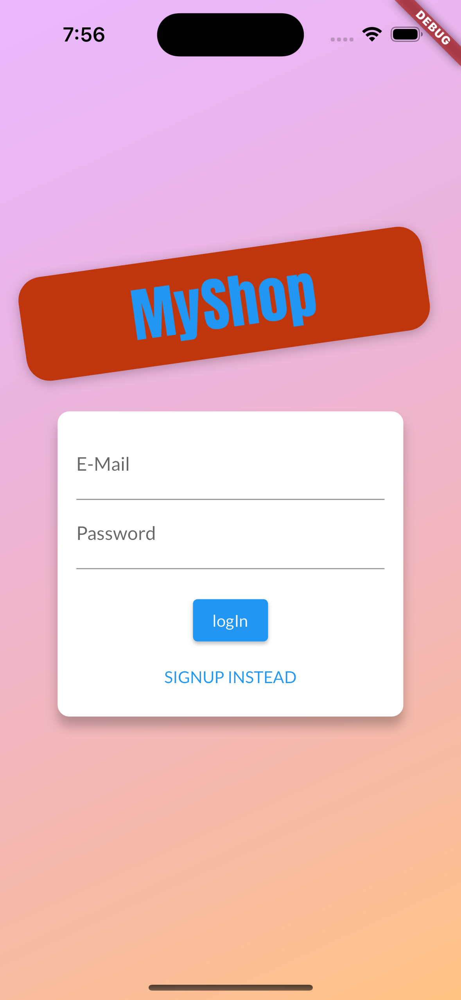
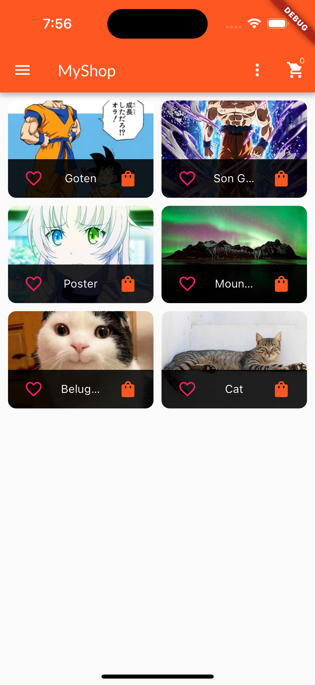
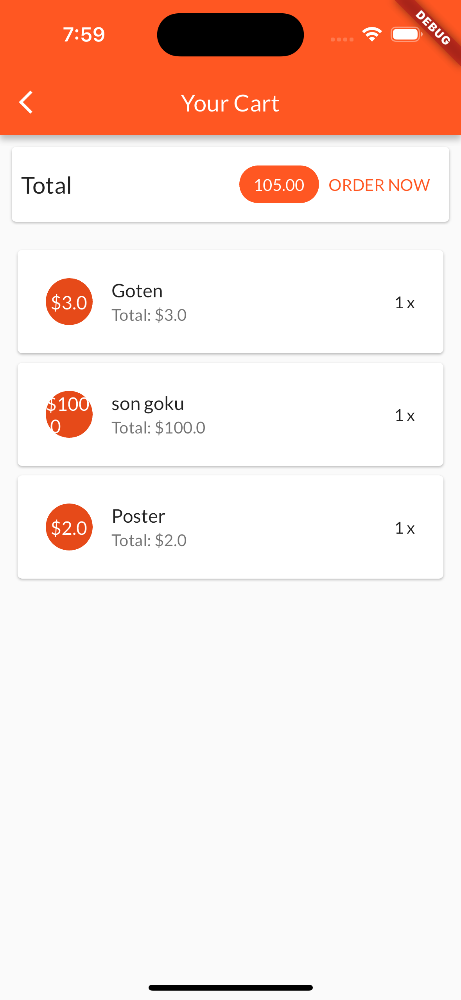
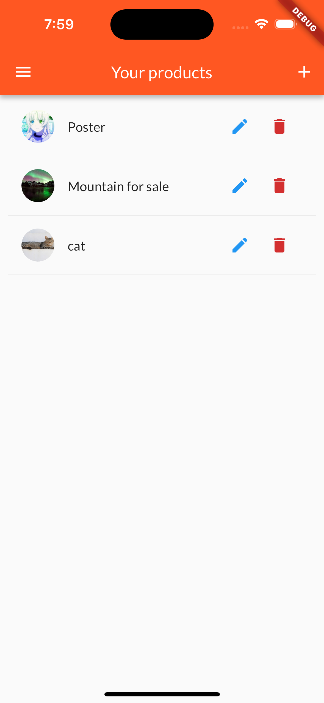
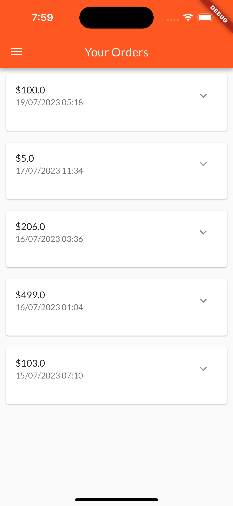

# Shop-App
An ecommerce Shop-App using Flutter.

## Interface

<p>
    
    
    
    
    
</p>

Clone Repository
```
git clone https://github.com/anoying-kid/Shop_App_flutter
```

Get required libraries
```
flutter pub get
```

## Working

